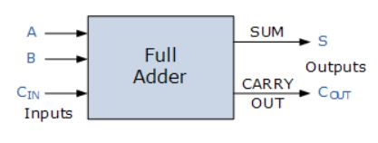
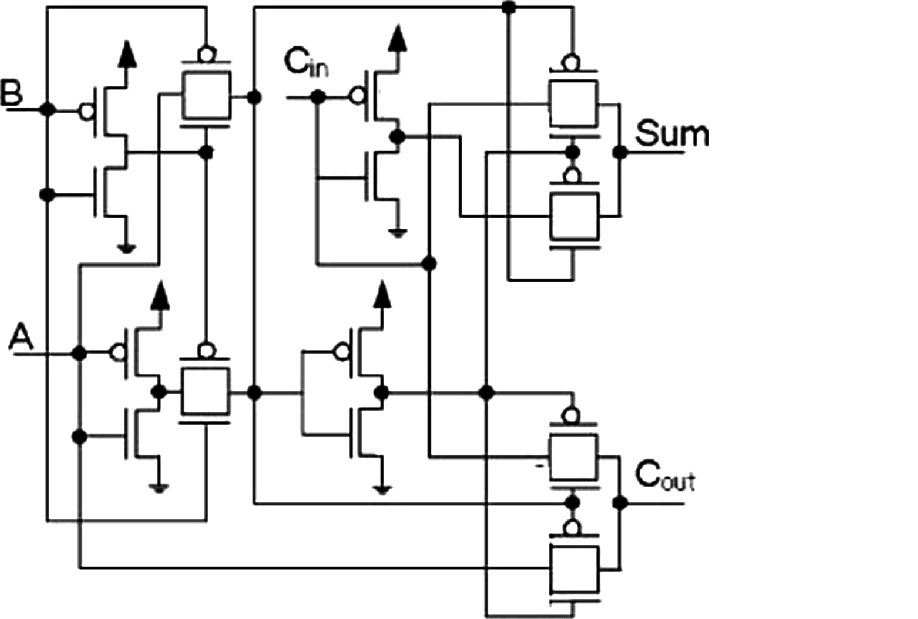
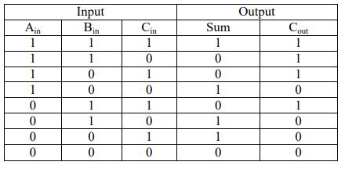
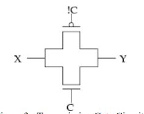
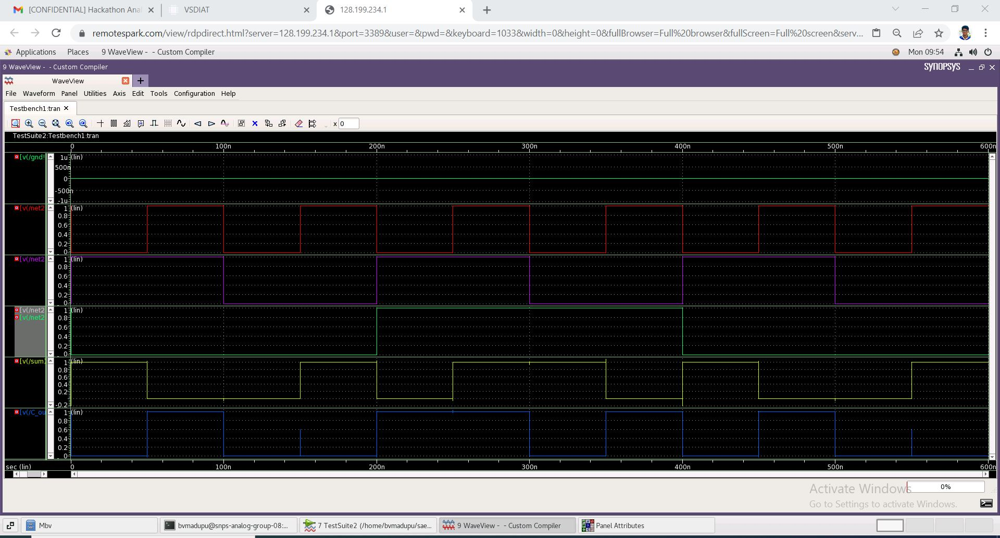

# Low Power CMOS Full Adder Circuit

- This repository presents the design of Low Power CMOS Full Adder implemented using Synopsis Custom Compiler on 28nm CMOS Technology.

- The proposed **Abstract** can be referred [here](sources/LowPowerCmosFullAdder.pdf)

 ## Table of contents
 - [Introduction](#Introduction)
 - [Reference Circuits](#Reference-Circuits) <br>
&emsp;[Block Diagram](#Block-Diagram) <br>
&emsp;[Reference Schematic](#Reference-Schematic) <br>
&emsp;[Truth Table](#Truth-Table)
 - [Operation](#Operation) 
 - [Tools Used](#Tools-Used) <br>
&emsp;[Synopsys Custom Compiler](#Synopsys-Custom-Compiler) <br>
&emsp;[Synopsys Primewave](#Synopsys-Primewave) <br>
&emsp;[Synopsys 28nm PD](#Synopsys-28nm-PD) 
- [Pre-Layout Schematics and Simulations](#Pre-Layout-Schematics-and-Simulations) <br>
&emsp;[Design Schematic](#Design-Schematic) <br>
&emsp;[Design Schematic Symbol](#Design-Schematic-Symbol) <br>
&emsp;[Design Test Bench Schematic](#Design-Test-Bench-Schematic)
- [Simulations](#Simulations) <br>
&emsp;[Transient Analysis](#Transient-Analysis)
- [Netlist of the Circuit](#Netlist-of-the-Circuit)
- [Author](#Author)
- [Acknowledgements](#Acknowledgements)
- [References](#References)


 ## Introduction
- In current years due to rapid growth and development of integration system of manufacturing if ICs from small scale integration (which allow the manufacturing of ICs with 1-10 transistor in a single chip) to ultra large scale integration (which allow manufacturing of ICs which consists of billions of transistor in a single chip) which lead the development in the electronics.

- Due to advancement of electronic world development takes place in the electronics devices in smart phones, laptops, computers which demand low power consumption, high speed performance with very less time propagation delay.

- In those devices arithmetic logic units adders plays a vital role to perform the various logical operation (addition, subtraction, multiplication, division) in a system. Full Adder is the adder which adds three inputs and produces two outputs.

- In conventional full adder circuits, we use CMOS technology i.e. PMOS and NMOS are used as a switch in complementary mode. Such applications of NMOS and PMOS as a switch is called pass transistor logic. In Transmission Gates, both NMOS and PMOS transistors are combined in parallel fashion.

- When performance of both the circuits was compared, transmission gate circuit consumed less power as compared to the pass transistor circuit designed using CMOS logic.
//image of transmission gate

- A transmission gate is defined as an electronic element that will selectively block or pass a signal level from the input to the output. This solid-state switch is comprised of a PMOS transistor and NMOS transistor. The transmission gate consists of two MOSFETs, one n-channel responsible for correct transmission of logic zeros, and one p-channel, responsible for correct transmission of logic ones.

## Reference Circuits

### Block Diagram

<p align="center">
    
    </br>
    
</p>

### Reference Schematic

<p align="center">
    
    </br>
    Full Adder
    </br>
    
</p>

### Truth Table

<p align="center">
    
    </br>
    Truth Table
    </br>
    
</p>

## Operation

- When C = 1, X and Y are connected, both logic zero and logic one are passed without degradation. A transmission gate has three inputs, called source, ngate, and p-gate; and it has one output, called drain. The two transistors, an NMOS and a PMOS are connected in parallel configuration. 

- When the control input is a logic zero (negative power supply potential), the gate of the NMOS is also at a negative supply voltage potential. The gate terminal of the PMOS is caused by the inverter, to the positive supply voltage potential. Regardless of on which switching terminal of the transmission gate (X or Y) a voltage is applied, the gate-source voltage of the NMOS is always negative, and the PMOS is always positive.

- Accordingly, neither of the two transistors will conduct and the transmission gate turns off. When the control input is a logic one, so the gate terminal of the NMOS is located at a positive supply voltage potential. By the inverter, the gate terminal of the PMOS is now at a negative supply voltage potential. As the substrate terminal of the transistors is not connected to the source terminal, the drain and source terminals are almost equal and the transistors start at a voltage difference between the gate terminal and one of these conducts.

-  One of the switching terminals of the transmission gate is raised to a voltage near the negative supply voltage, a positive gate-source voltage (gate-to-drain voltage) will occur at the NMOS, and the transistor begins to conduct, and the transmission gate conducts. 

-The voltage at one of the switching terminals of the transmission gate is now raised continuously up to the positive supply voltage potential, so the gate-source voltage is reduced (gate-drain voltage) on the NMOS, and this begins to turn off. 

-At the same time, the PMOS has a negative gate-source voltage (gate-to-drain voltage) builds up, whereby this transistor starts to conduct and the transmission gate switches. Thereby it is achieved that the transmission gate passes over the entire voltage range. Transmission gates are used in order to realize electronic switches and analog multiplexers.

- The relations between the inputs and the outputs are expressed as: 

```
SUM=(A⊕B) ⊕ Cin
Cout = A.B + Cin(A ⊕ B)

```

<p align="center">
    
    </br>
    Transmission Gate
    </br>
    
</p>

- Transmission gate based implementation is similar to pass transistor with the difference that transmission gate logic uses both NMOS and PMOS transistors connected in parallel where as pass transistor logic uses only one type of transistor i.e. either NMOS or PMOS. 

## Tools Used:

- ### Synopsys Custom Compiler:

The Synopsys Custom Compiler™ design environment is a modern solution for full-custom analog, custom digital, and mixed-signal IC design. As the heart of the Synopsys Custom Design Platform, Custom Compiler provides design entry, simulation management and analysis, and custom layout editing features. This tool was used to design the circuit on a transistor level.

- ### Synopsys Primewave:

PrimeWave™ Design Environment is a comprehensive and flexible environment for simulation setup and analysis of analog, RF, mixed-signal design, custom-digital and memory designs within the Synopsys Custom Design Platform. This tool helped in various types of simulations of the above designed circuit.

- ### Synopsys 28nm PDK:

The Synopsys 28nm Process Design Kit(PDK) was used in creation and simulation of the above designed circuit.

## Pre-Layout Schematics and Simulations:

### Design Schematic

- [Low Power Full Adder Schematic](sources/design_FA_schematic.pdf) 

### Design Schematic Symbol

- [Low Power Full Adder Schematic](sources/design_FA_symbol.pdf)

### Design Test Bench Schematic
- [Low Power Full Adder Schematic](sources/design_FA_tb_schematic.pdf)

### Simulations

The Final output [waveform](images/waveformsFinal.jpg)

#### Transient Analysis:

After creating and saving the schematic go to 'Tools' and open 'Primewave' to start the simulation. In the Primewave select the 'model file' i.e the '28nm PDK's .lib file presentin the HSPICE folder. After this select the 'tran' analysis in the analysis window and give the 'Start', 'Stop', and 'Step Size' parameters and save it. Then add the outputs which needs to be plotted by selecting the nets on the schematic.
One other thing we need to keep in mind is that here we have loop for which an initial condition needs to be declared. For that, we have to go to 'Setup -> Convergance aids' and select the net for which we want to set an initial condition.Then go to 'Simulations -> Netlist and Run' to generate a netlist and run the simulation to get the below output.

<p align="center">
    
    </br>
    Output Waveform
    </br>
    
</p>


## Netlist of the Circuit:

- Full Adder Schematic [Netlist](design_FA.v)
- Full Adder Testbench Schematic [Netlist](design_FA_tb.v)
- The Final [Netlist:](sources/netlist.txt) 

## Author:

[Bhargav Vamshi Madupu](https://www.linkedin.com/in/bhargav-vamshi-madupu-395117120), Btech(ECE), B V Raju Institute Of Technology, Narsapur, Telangana

## Acknowledgements:

- Cloud Based Analog IC Design Hackathon
- Synopsys India
- VLSI System Design (VSD) Corp. Pvt. Ltd India

## References:

- Y. Leblebici, S.M. Kang, CMOS Digital Integrated Circuits, Singapore: Mc Graw Hill, 2nd edition, 1999.
- R. Zimmermann, and W. Fichtner, “Low-power logic styles: CMOS versus pass-transistor logic,” IEEE J. Solid State Circuits, vol. 32, no. 7, pp. 1079-1090, Jul. 1997.
- N. Weste and K. Eshraghian, “Principles of CMOS VLSI Design, A System Perspective,” AddisonWesley,1993.
- N. Zhuang and H. Wu, “A new design of the CMOS full adder,” IEEE J. Solid-State Circuits, vol. 27, no. 5, pp. 840–844, May 1992
- https://www.ijarcce.com/upload/2015/july-15/IJARCCE%2041.pdf